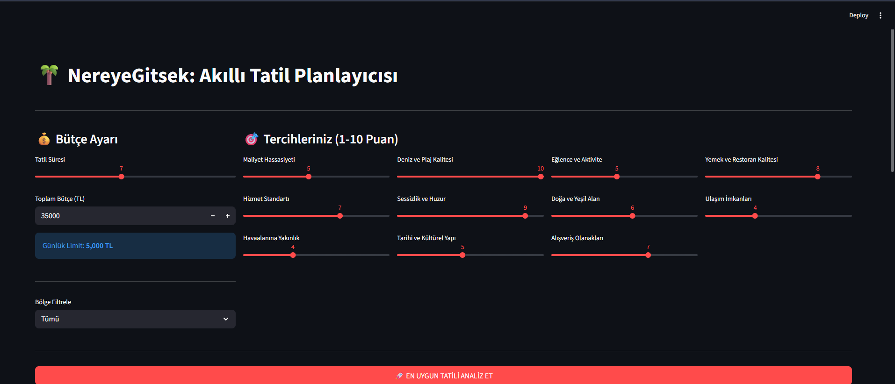
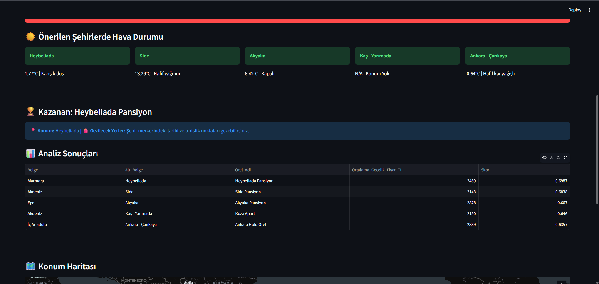
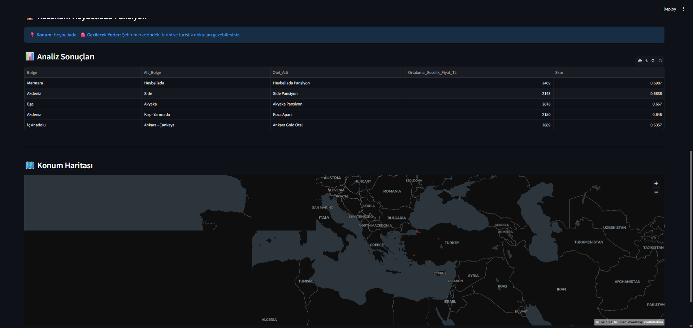

# 🌴 WhereverWeGo: Multi-Criteria Decision Support System
An advanced vacation planning tool that uses mathematical optimization to rank destinations based on user-specific preferences and real-time data.

## 📊 Project Preview & Smart Recommendations
Below are the interactive interfaces where the system analyzes and **recommends the best hotels and regions**:

### 📍 1. Smart Filtering & Regional Selection

*Users can filter by **specific regions** (Ege, Akdeniz, etc.) and set budget limits. The system calculates the best matches using 11 dynamic criteria.*

### 🏆 2. Top 5 Hotel Recommendations & Live Weather

*The system provides the **Top 5 most suitable hotel recommendations** with real-time weather integration for each recommended destination.*

### 🗺️ 3. Precise Location Mapping

*Interactive map showing the exact locations of the **recommended hotels** to help users visualize their trip.*

---

## 🧠 Core Methodology: "Finding the Best Match"
Instead of basic filtering, this system implements the **TOPSIS (Technique for Order of Preference by Similarity to Ideal Solution)** algorithm to find the absolute best option:

* **Personalized Ranking:** The system analyzes 300+ hotels to find the ones that best match the user's "Ideal Destination" profile.
* **Regional Optimization:** It identifies the **best hotels within the user's chosen region** based on mathematical scoring.
* **Ideal Matching:** The algorithm creates a hypothetical "Perfect Hotel" based on user weights and calculates geometric distances to it.

## 🚀 Key Features
* **Smart Recommendations:** Automatically identifies the 5 best-performing hotels for any given set of user preferences.
* **Data Engineering:** Migrated unstructured data from Excel to a structured **SQLite** environment.
* **External API Integration:** Real-time sync with **OpenWeatherMap** for current vacation conditions.
* **Automated Geocoding:** Used Nominatim API to retrieve geographic coordinates for map visualization.

## 🛠 Tech Stack
* **Language:** Python
* **Libraries:** Pandas, NumPy, Streamlit.
* **Database:** SQLite.
